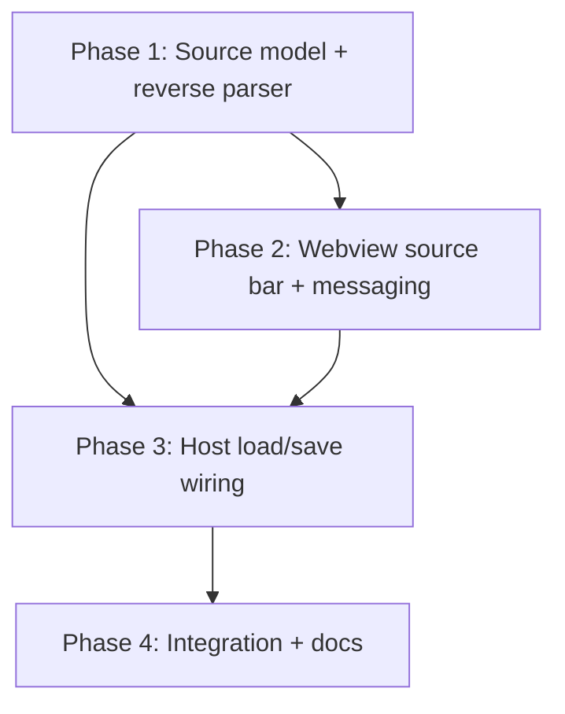
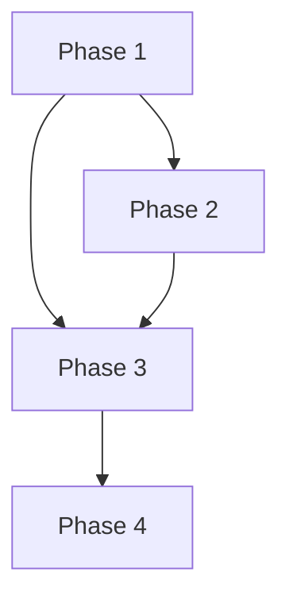

# Implementation Plan: Auto-detect and load .vscode/mcp.json as an editable configuration source

## Overview

Build the feature in four dependency-ordered phases: a pure source model + reverse parser, then the
webview UI for the source bar/banner, then the host wiring that loads and saves a file source, then
integration and documentation. The pure logic lands first so the UI and host phases have a tested
foundation to call.

## Affected Files

| File | Change Type | Description |
| ---- | ----------- | ----------- |
| vscode-extension/src/configSource.ts | Create | Source kinds, `detectWorkspaceMcpJson`, `parseServerArgs`, `parseMcpEntry` |
| vscode-extension/src/argsBuilder.ts | Update | Export small helpers the reverse parser shares (flag tables), if needed |
| vscode-extension/src/commands.ts | Update | Extract `writeMcpJsonFromSettings`; export `parseJsonc` reuse |
| vscode-extension/src/webview.ts | Update | Source bar, detection banner, switcher, new message handling, save routing |
| vscode-extension/src/extension.ts | Update | Pass workspace/context needed for detection; optional `editMcpJson` command |
| vscode-extension/test/unit/configSource.test.cjs | Create | Detection + reverse-parser + round-trip tests |
| vscode-extension/test/unit/commands.test.cjs | Update | `writeMcpJsonFromSettings` tests |
| vscode-extension/test/unit/webview.test.cjs | Update | Source-bar / load / save-to-file / guard tests |
| vscode-extension/test/integration/mcpJson.test.js | Update | Detect + round-trip with a fixture file |
| vscode-extension/README.md | Update | Document the source switcher and round trip |

## Phase 1: Source model and reverse parser

### Implementation Work (source model)

- Create `src/configSource.ts`:
  - `type ConfigSourceKind = 'settings' | 'mcpJson'` and a `ConfigSource` descriptor
    (`kind`, `uri?`, `label`, `readOnly?`, `pointer?` e.g. `servers.wcli0`).
  - `detectWorkspaceMcpJson(folder)`: read `${folder}/.vscode/mcp.json` via `vscode.workspace.fs`,
    parse with `parseJsonc` (imported from `commands.ts`), return `{ uri, hasWcli0 }`; swallow
    not-found/parse errors into `hasWcli0: false` so detection never throws.
  - `parseServerArgs(args: string[]): { settings: Partial<Wcli0Settings>; extraArgs: string[] }`: the
    inverse of `buildServerArgs`. Recognize `--shell`, repeated `--allowedDir`, `--initialDir`,
    `--commandTimeout`, `--maxCommandLength`, `--wslMountPoint`, `--blockedCommand/Argument/Operator`,
    `--maxOutputLines`, `--maxReturnLines`, `--enableTruncation` / `--no-enableTruncation`,
    `--enableLogResources` / `--no-...`, `--logDirectory`, `--allowAllDirs`, `--yolo` / `--unsafe`,
    `--debug`, `--config`, `--transport` + `--http-host/-port`, `--sse-host/-port`, allowed-origins.
    Accept both `--opt value` and `--opt=value`. Unknown tokens -> `extraArgs`.
  - `parseMcpEntry(entry): { settings: Wcli0Settings; notes: string[] }`: infer transport from
    `entry.type`; for stdio infer launch method from `command` (`npx` + `-y` -> npx/packageSpec;
    `node` -> node/nodeScriptPath; else custom/customCommand+customArgs); merge `parseServerArgs`
    output; map `cwd` -> `launch.cwd`, `env` -> `launch.env`; for http/sse derive host/port from the URL.
    Emit a note when `--config` (or per-shell/profiles) is present and cannot be fully represented.

### Test Work (source model)

- Create `test/unit/configSource.test.cjs`:
  - Detection: present-with-wcli0, present-without-wcli0, absent, malformed JSON, no workspace.
  - `parseServerArgs`: each recognized flag, `=`-form, repeated flags, negations, unknown passthrough.
  - `parseMcpEntry`: npx/node/custom stdio, http and sse URL parsing, `--config` note.
  - Round trip: for representative settings, `buildLaunchSpec(s)` -> `parseMcpEntry(entry)` reproduces the
    modeled fields; leftover/unknown flags appear in `extraArgs`.

### Verification (source model)

- `npx tsc --noEmit -p ./` clean.
- `node --require ./test/stubs/hook.cjs --test test/unit/configSource.test.cjs` passes.

## Phase 2: Webview source bar and messaging

### Implementation Work (source bar)

- In `src/webview.ts` `renderHtml`: add the source bar above the tab nav — active-source chip (kind +
  path/pointer), a "Switch source" menu, and a detection banner placeholder. Nest the existing
  `Save to: Workspace / User` radio under the `settings` source; when a file source is active, hide the
  radio and relabel Save to "Save to file" with a Revert action and a dirty indicator.
- In the webview script: render `init.source` and `init.detected`; build the switcher menu (Settings,
  detected `.vscode/mcp.json` tagged when `hasWcli0`, read-only home config as disabled,
  "New config from current settings" -> existing export, "Open another file..." placeholder); post
  `selectSource` / `loadSource` and `saveToFile`; track dirty state and request confirmation on a source
  switch with unsaved edits (reuse the `scopeChangeRequest` round-trip shape).

### Test Work (source bar)

- Update `test/unit/webview.test.cjs`: HTML contains the source bar and banner nodes; given an `init`
  with a detected wcli0 source the banner is shown; switching to the file source posts `loadSource`;
  saving a file source posts `saveToFile`; the home config entry is rendered disabled.

### Verification (source bar)

- `npx tsc --noEmit -p ./` clean.
- `node --require ./test/stubs/hook.cjs --test test/unit/webview.test.cjs` passes.

## Phase 3: Host load and save wiring

### Implementation Work (host wiring)

- In `src/commands.ts`: extract the post-resolution body of `writeWorkspaceMcpJson` into
  `writeMcpJsonFromSettings(settings, folder, configFileLoadable?)`; have `writeWorkspaceMcpJson` build
  settings from scope and delegate (no behavior change). The file-source save calls the same function
  with form-derived settings and must not touch `config.update`.
- In `src/webview.ts` `setupWebview`: add `currentSource` state next to `currentScope`. On `ready`,
  detect the workspace mcp.json (`detectWorkspaceMcpJson`) and include `source` + `detected` in the
  `init` payload. Handle `loadSource` (read the file, `parseMcpEntry`, post an `init` populated from the
  file, set `currentSource` to the file, surface any notes) and `saveToFile` (collect form values like
  the `save` path, build a `Wcli0Settings`, call `writeMcpJsonFromSettings`, then mark saved). Reject a
  read-only/home source as a load or save target. Gate the external `post(true)` reload so it does not
  overwrite an active file source from settings.

### Test Work (host wiring)

- Update `test/unit/commands.test.cjs`: `writeMcpJsonFromSettings` preserves a second server, refuses a
  non-object root / non-object `servers`, warns on comments, and never calls `config.update`.
- Update `test/unit/webview.test.cjs`: `ready` posts detected sources; `loadSource` populates the form
  from a fake file; `saveToFile` writes via the file writer; home config rejected as a save target;
  external settings change does not clobber a file source.

### Verification (host wiring)

- `npx tsc --noEmit -p ./` clean.
- `node --require ./test/stubs/hook.cjs --test test/unit/*.test.cjs` passes.

## Phase 4: Integration and documentation

### Implementation Work (integration and docs)

- Update `test/integration/mcpJson.test.js` (or fixture under `test/integration/fixtures/ws/.vscode/`) to
  include a `.vscode/mcp.json` with a `servers.wcli0` entry plus a second server, then assert detection
  and a save-back round trip preserving the second server.
- Update `README.md`: document the configuration-source switcher, auto-detection of
  `.vscode/mcp.json`, the `load -> edit -> save` round trip, and that the home config is read-only and
  side-by-side editing is a future addition.

### Test Work (integration and docs)

- `npx vscode-test` passes including the new detection/round-trip assertions.
- `npx markdownlint-cli2 "docs/tasks/autodetect_mcp_source/*.md"` passes.

### Verification (integration and docs)

- Full suites green; markdownlint clean; `tsc --noEmit` clean.

## Dependency Graph

## Estimated Scope

| Phase | Source Files | Test Files | Effort |
| ----- | ------------ | ---------- | ------ |
| Phase 1: Source model + reverse parser | 1-2 | 1 | Medium |
| Phase 2: Webview source bar + messaging | 1 | 1 | Medium |
| Phase 3: Host load/save wiring | 2 | 2 | Medium |
| Phase 4: Integration + docs | 2 | 1 | Small |
