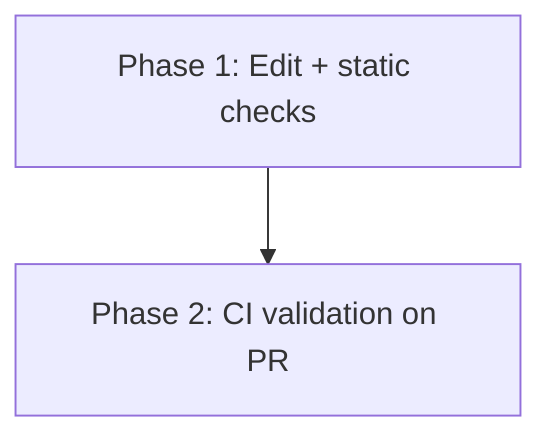
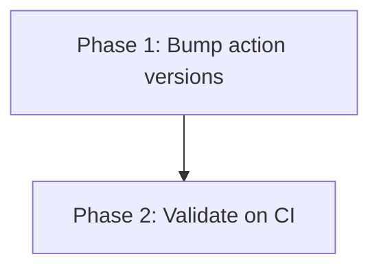

# Implementation Plan: Bump GitHub Actions to Node 24-Compatible Versions

## Overview

A two-phase, version-only maintenance change. Phase 1 edits the action pins in
both workflow files and statically verifies the edits. Phase 2 validates the
change against a real CI run on a pull request and confirms the deprecation
warning is gone.

## Affected Files

| File | Change Type | Description |
| ---- | ----------- | ----------- |
| `.github/workflows/build-and-test.yml` | Update | Bump 3x `checkout@v3` and 3x `setup-node@v3` to the Node 24 major (`@v5`) |
| `.github/workflows/publish.yml` | Update | Bump `checkout@v4` and `setup-node@v3` to the Node 24 major (`@v5`) |

## Phase 1: Bump action versions

### Implementation Work (Phase 1)

- Confirm the latest stable major of `actions/checkout` and `actions/setup-node`
  that bundles the Node 24 runtime (expected `@v5`). Use the same target tag for
  both files.
- In `.github/workflows/build-and-test.yml`:
  - `test-linux`: change `actions/checkout@v3` (line 19) and
    `actions/setup-node@v3` (line 21) to the target major.
  - `test-windows`: change `actions/checkout@v3` (line 39) and
    `actions/setup-node@v3` (line 41).
  - `test-windows-no-bash`: change `actions/checkout@v3` (line 56) and
    `actions/setup-node@v3` (line 57).
- In `.github/workflows/publish.yml`:
  - `publish`: change `actions/checkout@v4` (line 16) and
    `actions/setup-node@v3` (line 17).
- Do not touch `node-version`, `registry-url`, job structure, triggers, or any
  custom `pwsh`/`cmd` steps.

### Test Work (Phase 1)

- No code tests to add. Add static guards:
  - Grep `.github/workflows/` for `actions/checkout@v3`, `actions/checkout@v4`,
    and `actions/setup-node@v3`; expect zero matches.
  - Grep for the target tag; expect 4 `checkout` and 4 `setup-node` matches.

### Verification (Phase 1)

- Run the static grep assertions (see verification.md).
- Validate YAML parses (e.g. parse each file with a YAML loader, or rely on
  `actionlint` if available).
- Confirm the only diff lines are the eight `uses:` version tags.

## Phase 2: Validate on CI

### Implementation Work (Phase 2)

- Push the branch and open a pull request (the path-ignore filters skip docs-only
  changes, so ensure the workflow file edits are in the PR to trigger
  `Build and Test`).

### Test Work (Phase 2)

- None beyond observing the triggered workflow run.

### Verification (Phase 2)

- Confirm `test-linux`, `test-windows`, and `test-windows-no-bash` all pass.
- Inspect the run logs and confirm no action-runtime / "deprecated Node version"
  warnings remain.
- For `publish.yml` (not triggerable by PR), confirm via diff review and YAML
  parse that the change matches the build workflow's runtime bump.

## Dependency Graph

## Estimated Scope

| Phase | Source Files | Test Files | Effort |
| ----- | ------------ | ---------- | ------ |
| Phase 1 | 2 | 0 | Small |
| Phase 2 | 0 | 0 | Small |
