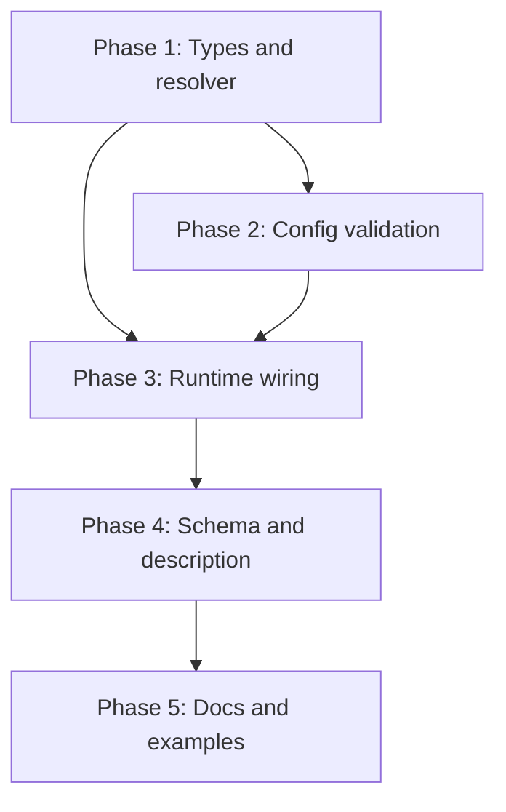

# Implementation Plan: Named Environment Profiles for execute_command

## Overview

Add an operator-defined `profiles` map to the server config and an optional `profile` parameter to `execute_command`. A pure resolver interpolates and merges the selected profile's environment into the child process environment at the single existing spawn choke point. Work proceeds bottom-up: types and resolver first, then config validation, then runtime wiring, then schema/description surfacing, then docs.

## Affected Files

| File | Change Type | Description |
| ---- | ----------- | ----------- |
| src/types/config.ts | Modify | Add `EnvProfileConfig`; add `profiles?` to `ServerConfig` |
| src/utils/envProfiles.ts | Create | `interpolateEnvValue` and `resolveProfileEnv` pure helpers |
| src/utils/config.ts | Modify | Parse and validate `profiles` at load time |
| src/index.ts | Modify | Thread `profile` arg; merge resolved env into `envVars` |
| src/utils/toolSchemas.ts | Modify | Add optional `profile` to execute_command schema |
| src/utils/toolDescription.ts | Modify | List configured profiles in the description |
| tests/envProfiles.test.ts | Create | Unit tests for resolver and interpolation |
| tests/integration/endToEnd.test.ts | Modify | Integration tests for env merge and errors |
| config.examples/profiles.json | Create | Example config with two sqlplus profiles |
| README.md | Modify | Document `profiles` config and `profile` parameter |
| docs/CONFIGURATION_EXAMPLES.md | Modify | Add profiles example section |
| docs/defaults.md | Modify | Note default empty profiles |

## Phase 1: Types and resolver

### Implementation Work

- In `src/types/config.ts`, add `export interface EnvProfileConfig { description?: string; allowedShells?: ShellType[]; env: Record<string, string>; }` and add `profiles?: Record<string, EnvProfileConfig>;` to `ServerConfig`.
- Create `src/utils/envProfiles.ts`:
  - `interpolateEnvValue(value, base)` replacing `${NAME}` with `base[NAME] ?? ''`.
  - `resolveProfileEnv(profiles, profileName, shellType, base)` returning `{}` for empty name, throwing a typed `ProfileSelectionError` for unknown name (message lists valid names) or disallowed shell, else returning the interpolated env map.

### Test Work

- Create `tests/envProfiles.test.ts` covering interpolation (present, absent, multiple, none) and resolution (empty name, unknown name, disallowed shell, happy path, precedence over base).

### Verification

- `npm run build` compiles.
- `npx jest tests/envProfiles.test.ts` passes.

## Phase 2: Config validation

### Implementation Work

- In `src/utils/config.ts`, default `profiles` to `{}` when absent.
- Validate each profile: `env` is a non-empty object of string-to-string; `allowedShells` entries are valid `ShellType`s; throw descriptive errors naming the offending profile.

### Test Work

- Add config cases to `tests/envProfiles.test.ts` (or a config test): valid profiles load; invalid `allowedShells`, non-string env value, and empty env are rejected; missing `profiles` yields empty set.

### Verification

- `npx jest tests/envProfiles.test.ts` passes, including the new config cases.

## Phase 3: Runtime wiring

### Implementation Work

- In `src/index.ts`, change `executeShellCommand` signature to accept `profile?: string` and update the call at `src/index.ts:1103` to pass `args.profile`.
- Replace `let envVars = { ...process.env };` with `let envVars = { ...process.env, ...resolveProfileEnv(this.config.profiles, profile, shellConfig.type, process.env) };`, keeping the WSL `WSL_ORIGINAL_PATH` assignment after the merge.
- Wrap `ProfileSelectionError` into `McpError(ErrorCode.InvalidParams, ...)` in the handler.

### Test Work

- In `tests/integration/endToEnd.test.ts`: a command echoing a profile env var returns the profile value; `PATH` prepend ordering holds; unknown profile returns InvalidParams; no-profile call leaves env unchanged.

### Verification

- `npm run test:integration` passes.
- Backward-compatibility test (no profile) passes.

## Phase 4: Schema and description

### Implementation Work

- In `src/utils/toolSchemas.ts`, add optional `profile` string to `buildExecuteCommandSchema` properties (not `required`), with a description and, when available, an enum of configured profile names.
- In `src/utils/toolDescription.ts`, append an "Available env profiles" block listing name and description when profiles are configured.

### Test Work

- Unit tests asserting the schema exposes `profile`, the enum lists configured names, and the description includes profile names; both are unchanged when no profiles are configured.

### Verification

- `npx jest tests/toolDescription.test.ts tests/envProfiles.test.ts` passes.

## Phase 5: Docs and examples

### Implementation Work

- Create `config.examples/profiles.json` with two `sqlplus` profiles (`ora11`, `ora19`) demonstrating `${PATH}` prepend and `allowedShells`.
- Update `README.md`, `docs/CONFIGURATION_EXAMPLES.md`, and `docs/defaults.md` to document the `profiles` config block and the `profile` parameter.

### Test Work

- None (documentation). Confirm markdown lint passes.

### Verification

- `npx markdownlint-cli2` (or repo lint task) is clean on changed markdown.
- `npm run lint` (tsc `--noEmit`) is clean.

## Dependency Graph

## Estimated Scope

| Phase | Source Files | Test Files | Effort |
| ----- | ------------ | ---------- | ------ |
| Phase 1 | 2 | 1 | Small |
| Phase 2 | 1 | 1 | Small |
| Phase 3 | 1 | 1 | Medium |
| Phase 4 | 2 | 2 | Small |
| Phase 5 | 4 | 0 | Small |
