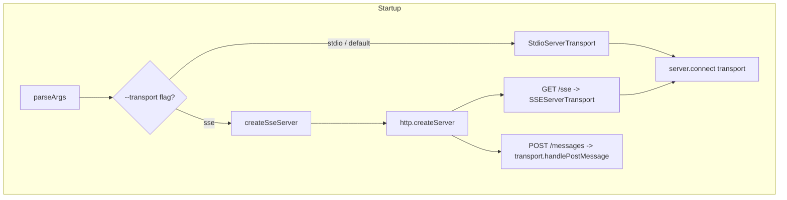
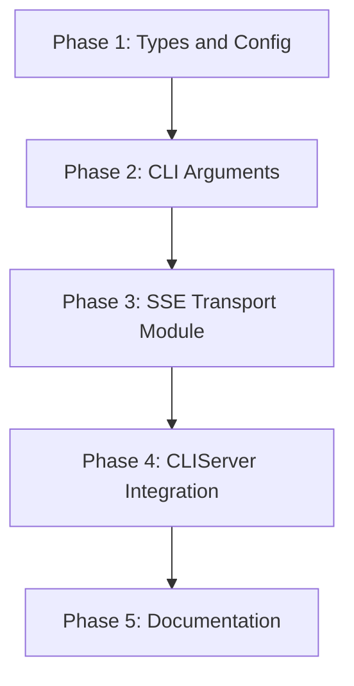

# Implementation Plan: HTTP/SSE Transport for MCP Server

## Overview

Add HTTP/SSE transport as an alternative to stdio. The server detects the transport mode from CLI flags or config file, then either starts stdio (existing path) or creates an HTTP server with `SSEServerTransport`. A new `src/utils/transport.ts` module encapsulates all HTTP/SSE setup logic.



## Affected Files

| File | Change Type | Description |
| ---- | ----------- | ----------- |
| `src/utils/transport.ts` | Create | SSE transport factory, HTTP server setup, session routing |
| `src/types/config.ts` | Update | Add `TransportConfig` type and fields |
| `src/utils/config.ts` | Update | Load transport config from file, apply CLI overrides |
| `src/index.ts` | Update | Add CLI flags to `parseArgs()`, update `CLIServer.run()` |
| `tests/unit/transport.test.ts` | Create | Unit tests for transport selection and config |
| `tests/integration/sse-transport.test.ts` | Create | Integration tests for SSE transport |
| `README.md` | Update | Document new CLI flags and config options |

## Phase 1: Types and Configuration

### Implementation Work

- Add `TransportConfig` interface to `src/types/config.ts`:

```typescript
export interface TransportConfig {
  mode: 'stdio' | 'sse';
  sseHost: string;
  ssePort: number;
}
```

- Add `transport` field to `ServerConfig` in `src/types/config.ts`.
- Add default transport config to `DEFAULT_CONFIG` in `src/utils/config.ts`:

```typescript
transport: {
  mode: 'stdio',
  sseHost: '127.0.0.1',
  ssePort: 9444
}
```

- Add `applyCliTransport()` function in `src/utils/config.ts` that applies `--transport`, `--sse-host`, `--sse-port` overrides to the loaded config.
- Load transport section from config file (if present) in the existing config loading flow.

### Test Work

- Unit test: verify `TransportConfig` defaults are correct.
- Unit test: verify `applyCliTransport()` overrides config values.
- Unit test: verify CLI flags take precedence over config file values.

### Verification

```bash
npm run lint
npm test -- tests/unit/
```

## Phase 2: CLI Arguments

### Implementation Work

- Add to `parseArgs()` in `src/index.ts`:

```typescript
.option('transport', {
  type: 'string',
  choices: ['stdio', 'sse'],
  description: 'Transport protocol (default: stdio)'
})
.option('sse-host', {
  type: 'string',
  description: 'Host address for SSE transport (default: 127.0.0.1)'
})
.option('sse-port', {
  type: 'number',
  description: 'Port for SSE transport (default: 9444)'
})
```

- Call `applyCliTransport()` in the `main()` function after loading config.

### Test Work

- Unit test: `parseArgs` returns correct defaults when no transport flags.
- Unit test: `parseArgs` returns `--transport sse` correctly.
- Unit test: `parseArgs` returns `--sse-host` and `--sse-port` correctly.

### Verification

```bash
npm run lint
npm test -- tests/unit/
```

## Phase 3: SSE Transport Module

### Implementation Work

- Create `src/utils/transport.ts` with:

```typescript
export function createSseServer(
  mcpServer: Server,
  host: string,
  port: number
): Promise<http.Server>
```

- The function:
  1. Creates `http.createServer()`.
  2. Maintains a `Map<string, SSEServerTransport>` for session routing.
  3. On `GET /sse`: creates `SSEServerTransport('/messages', res)`, calls `transport.start()`, stores transport by session ID, connects to `mcpServer`.
  4. On `POST /messages`: extracts session ID from URL, looks up transport, calls `transport.handlePostMessage(req, res)`.
  5. Returns a promise that resolves with the `http.Server` once it's listening.
- Export a `closeSseServer(server)` helper for clean shutdown.

### Test Work

- Unit test: `createSseServer` creates an HTTP server that listens.
- Unit test: GET `/sse` returns SSE content type headers.
- Unit test: POST to non-existent session returns error.
- Unit test: session map is populated after SSE connection.

### Verification

```bash
npm run lint
npm test -- tests/unit/transport.test.ts
```

## Phase 4: CLIServer Integration

### Implementation Work

- Update `CLIServer.run()` in `src/index.ts`:

```typescript
async run(): Promise<void> {
  if (this.config.transport?.mode === 'sse') {
    const { createSseServer } = await import('./utils/transport.js');
    const host = this.config.transport.sseHost ?? '127.0.0.1';
    const port = this.config.transport.ssePort ?? 9444;
    const httpServer = await createSseServer(this.server, host, port);
    debugLog(`Windows CLI MCP Server running on SSE at http://${host}:${port}`);
  } else {
    const transport = new StdioServerTransport();
    await this.server.connect(transport);
    debugLog("Windows CLI MCP Server running on stdio");
  }
}
```

- Update cleanup handler to close HTTP server if in SSE mode.
- Store the HTTP server reference on `CLIServer` for cleanup.

### Test Work

- Integration test: start `CLIServer` in SSE mode on port 0.
- Integration test: client connects to SSE, sends `initialize` request, receives response.
- Integration test: server shuts down cleanly on signal.
- Regression test: stdio mode still works end-to-end.

### Verification

```bash
npm run lint
npm test -- tests/integration/sse-transport.test.ts
npm test
```

## Phase 5: Documentation

### Implementation Work

- Update `README.md` to document:
  - `--transport` flag with choices and default.
  - `--sse-host` and `--sse-port` flags with defaults.
  - Config file `transport` section example.
  - Usage example: `npx wcli0 --transport sse`.

### Test Work

- Verify README examples are syntactically correct.

### Verification

```bash
npm run lint
```

## Dependency Graph



## Estimated Scope

| Phase | Source Files | Test Files | Effort |
| ----- | ------------ | ---------- | ------ |
| Phase 1 | 2 | 1 | Small |
| Phase 2 | 1 | 1 | Small |
| Phase 3 | 1 | 1 | Medium |
| Phase 4 | 1 | 1 | Medium |
| Phase 5 | 1 | 0 | Small |
