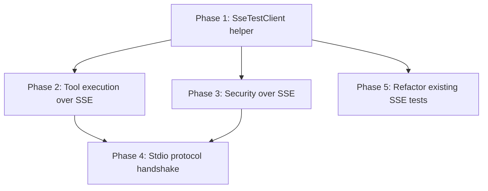

# Test Implementation Plan: Integration Test Coverage Gaps

## Purpose

Close the test coverage gaps identified in `test-coverage-comparison.md`. The existing SSE tests verify transport-layer mechanics but barely exercise the actual MCP tools. The existing stdio tests exercise tools directly but skip the MCP protocol handshake. This plan adds tests that cover both gaps.

## Affected Files

| File | Change Type | Description |
| ---- | ----------- | ----------- |
| `tests/helpers/SseTestClient.ts` | Create | Reusable SSE client helper for integration tests |
| `tests/integration/sse-transport.test.ts` | Update | Add tool execution and security tests over SSE |
| `tests/integration/mcpProtocol.test.ts` | Update | Add protocol handshake tests for stdio |
| `tests/integration/sse-tool-execution.test.ts` | Create | Dedicated SSE tool execution integration tests |
| `tests/integration/sse-security.test.ts` | Create | Security scenario tests over SSE transport |

## Phase 1: Shared SSE Test Helper

### Why

The existing `sse-transport.test.ts` has inline `connectSSE`, `postMessage`, `waitForMessage` helpers duplicated in every test. Extracting these into a reusable module reduces boilerplate and ensures consistent test patterns across new test files.

### Implementation

Create `tests/helpers/SseTestClient.ts`:

```typescript
export class SseTestClient {
  // Starts CLIServer in SSE mode on port 0, connects SSE stream,
  // performs initialize + initialized handshake automatically.
  static async create(configOverrides?: Partial<ServerConfig>): Promise<SseTestClient>

  // Sends a JSON-RPC request and returns the response.
  async call(method: string, params?: object): Promise<any>

  // Calls a tool by name with arguments and returns the result.
  async callTool(name: string, args: Record<string, any>): Promise<any>

  // Tears down SSE stream and closes HTTP server.
  async close(): Promise<void>
}
```

### Verification

```bash
npm test -- tests/integration/sse-transport.test.ts
```

Existing tests should continue to pass after refactoring to use the new helper.

## Phase 2: Tool Execution Over SSE

### Why

The comparison shows that only `get_config` is tested over SSE. The primary tool `execute_command` and the validation tool `validate_directories` have zero SSE coverage.

### Test Cases

File: `tests/integration/sse-tool-execution.test.ts`

| Test Case | Description |
| --------- | ----------- |
| execute_command basic echo | Call `execute_command` over SSE with `echo hello`, verify output contains `hello` and exitCode is 0 |
| execute_command with workingDir | Call `execute_command` with explicit `workingDir`, verify `workingDirectory` in metadata matches |
| execute_command output metadata | Call `seq 1 50` with `maxOutputLines: 20`, verify `totalLines`, `returnedLines`, `wasTruncated` |
| execute_command with timeout | Call a short command with explicit `timeout`, verify it completes within the timeout |
| execute_command failed command | Call `ls /nonexistent`, verify `exitCode` is non-zero and output contains error text |
| validate_directories valid path | Call `validate_directories` with allowed path, verify no error |
| validate_directories invalid path | Call `validate_directories` with disallowed path, verify error response |
| get_config returns structure | Call `get_config`, verify response has `global`, `shells`, `transport` sections |
| get_current_directory | Call `get_current_directory`, verify it returns a valid path |
| set_current_directory | Call `set_current_directory` with a valid path, then `get_current_directory` to confirm |
| tools/list includes all tools | Verify `execute_command`, `get_config`, `get_current_directory`, `set_current_directory`, `validate_directories` are listed |

### Verification

```bash
npm test -- tests/integration/sse-tool-execution.test.ts
```

## Phase 3: Security Scenarios Over SSE

### Why

The comparison shows zero security tests over SSE. Blocked operators, path restrictions, and injection protection are only tested via direct `_executeTool` calls. These must also work through the full SSE transport path.

### Test Cases

File: `tests/integration/sse-security.test.ts`

| Test Case | Description |
| --------- | ----------- |
| blocked operator rejection | Call `execute_command` with `echo hi ; ls` (blocked `;`), verify MCP error response |
| blocked pipe rejection | Call `execute_command` with `echo hi \| grep hi` (blocked `\|`), verify MCP error response |
| blocked ampersand rejection | Call `execute_command` with `echo hi & ls` (blocked `&`), verify MCP error response |
| path restriction enforced | Configure `restrictWorkingDirectory: true` with `allowedPaths: ['/allowed']`, call `execute_command` with `workingDir: '/tmp'`, verify error |
| path restriction allowed | Configure `restrictWorkingDirectory: true` with `allowedPaths: ['/tmp']`, call `execute_command` with `workingDir: '/tmp'`, verify success |
| unknown tool name | Call a non-existent tool name, verify MCP error with appropriate error code |
| missing required argument | Call `execute_command` without `command` argument, verify validation error |
| invalid shell name | Call `execute_command` with `shell: 'nonexistent'`, verify error |
| command too long | Configure `maxCommandLength: 10`, send a command exceeding it, verify error |
| unknown session POST | POST a message to a non-existent session ID, verify HTTP 404 |
| concurrent sessions isolated | Open two SSE sessions on separate servers, verify each gets its own responses |

### Verification

```bash
npm test -- tests/integration/sse-security.test.ts
```

## Phase 4: Stdio Protocol Handshake Tests

### Why

The comparison shows stdio tests bypass the MCP protocol handshake entirely by calling `_executeTool` directly. While the transport is implicitly tested by the fact that tools work, the protocol-level behavior (initialize, capabilities negotiation, notifications) is not verified for stdio.

### Test Cases

Update `tests/integration/mcpProtocol.test.ts`:

| Test Case | Description |
| --------- | ----------- |
| initialize handshake via stdio | Use `StdioServerTransport` + `Client` from MCP SDK to perform full initialize handshake against `CLIServer`, verify `serverInfo.name` is `wcli0` |
| initialized notification via stdio | Complete initialize, then send `notifications/initialized`, verify no error |
| tools/list via stdio client | After handshake, call `tools/list` through SDK client, verify all expected tools are present |
| tools/call via stdio client | After handshake, call `get_config` through SDK client, verify response structure |
| error response on unknown method | Send a JSON-RPC request with unknown method, verify error response |

### Note

This requires spawning the server as a child process or using `StdioServerTransport` in-memory. The MCP SDK provides `Client` class that can connect to a `Server` via in-memory transport for testing. See `@modelcontextprotocol/sdk/dist/inMemory.test.js` for the pattern.

### Verification

```bash
npm test -- tests/integration/mcpProtocol.test.ts
```

## Phase 5: Refactor Existing SSE Tests

### Why

The existing `sse-transport.test.ts` has inline helper functions (`connectSSE`, `postMessage`, `waitForMessage`) that are duplicated. Once the shared `SseTestClient` helper exists, refactor to use it. This reduces maintenance burden and ensures consistency.

### Implementation

- Replace inline helpers in `sse-transport.test.ts` with `SseTestClient`
- Keep the transport-layer tests (server start, SSE headers, 404/400 responses, close) as-is since they test lower-level HTTP behavior
- Move protocol-handshake tests that are already passing to use `SseTestClient` for brevity

### Verification

```bash
npm test -- tests/integration/sse-transport.test.ts
```

## Dependency Graph



Phases 2 and 3 can run in parallel after Phase 1. Phase 4 is independent of SSE work but depends on understanding the patterns from Phases 2-3. Phase 5 is cleanup and can happen last.

## Coverage Targets

After all phases are complete, both transports should have matching coverage:

| Category | stdio | HTTP/SSE |
| -------- | ----- | -------- |
| Protocol handshake | Phase 4 | Already covered |
| tools/list | Phase 4 | Already covered |
| execute_command | Already covered | Phase 2 |
| get_config | Already covered | Already covered |
| validate_directories | Already covered | Phase 2 |
| get/set current directory | Already covered | Phase 2 |
| Blocked operators | Already covered | Phase 3 |
| Path restrictions | Already covered | Phase 3 |
| Error handling | Already covered | Phase 3 |
| Transport lifecycle | N/A | Already covered |
| Concurrent sessions | N/A | Phase 3 |

## Scope

| Phase | New Files | Updated Files | Test Cases Added |
| ----- | --------- | ------------- | ---------------- |
| Phase 1 | 1 | 0 | 0 (refactor only) |
| Phase 2 | 1 | 0 | 11 |
| Phase 3 | 1 | 0 | 11 |
| Phase 4 | 0 | 1 | 5 |
| Phase 5 | 0 | 1 | 0 (refactor only) |
| **Total** | **3** | **2** | **27** |
