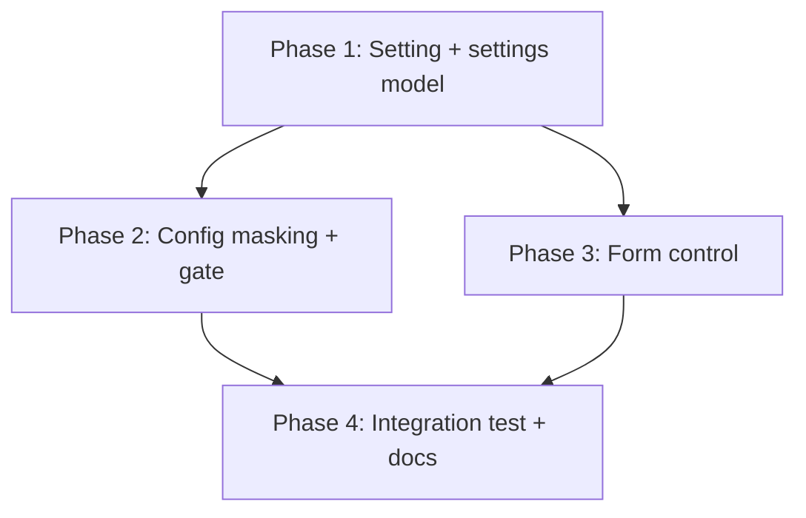
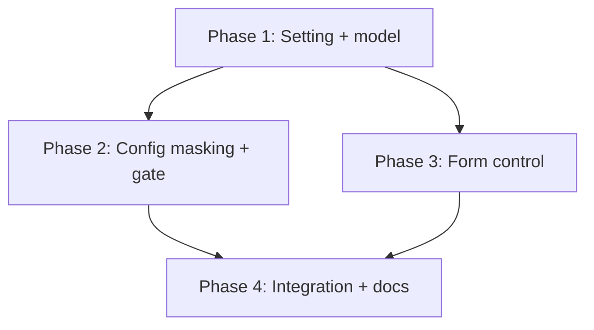

# Implementation Plan: Let a workspace opt out of inherited environment profiles

## Overview

Add a new boolean setting `wcli0.ignoreInheritedProfiles` that gates `hasProfilesConfig` and masks
`profiles` in `buildConfigFile`, wire it through the normalized settings model (honored Workspace-only),
surface it in the configuration form's Profiles tab, and document it. The work is layered: settings
model first (the authoritative gate), then config-file masking and provider/export behavior, then the
form, then docs, with an integration test validating the real VS Code deep-merge case. It mirrors the
shipped `ignoreInheritedShells` feature throughout.

## Affected Files

| File | Change Type | Description |
| ---- | ----------- | ----------- |
| vscode-extension/package.json | Update | Add `wcli0.ignoreInheritedProfiles` boolean setting |
| vscode-extension/src/settings.ts | Update | Add flag to `Wcli0Settings`/`buildSettings`; Workspace-only recompute; force false for Global; add to `INHERITABLE_SELECT_KEYS`; gate `hasProfilesConfig` |
| vscode-extension/src/configFile.ts | Update | Mask `profiles` to `{}` in `buildConfigFile` when the flag is set |
| vscode-extension/src/mcpProvider.ts | Verify | No logic change if gating lives in `hasProfilesConfig`; confirm launch path |
| vscode-extension/src/commands.ts | Verify | Confirm show/export branch on `hasProfilesConfig` |
| vscode-extension/src/webview.ts | Update | Add the flag to the field model, render the toggle on the Profiles tab, wire collect/populate, drive the isolation chip |
| vscode-extension/test/unit/settings.test.cjs | Update | `hasProfilesConfig` gate + Workspace-only recompute tests |
| vscode-extension/test/unit/configFile.test.cjs | Update | `buildConfigFile` masks `profiles` when flag set |
| vscode-extension/test/unit/webviewProfiles.test.cjs | Update | Form collect/populate + round-trip of the toggle |
| vscode-extension/test/unit/commands.test.cjs | Update | Export not blocked by inherited profiles when flag set |
| vscode-extension/test/integration/extension.test.js | Update | Real deep-merge end-to-end test |
| vscode-extension/README.md | Update | Document inherit-vs-mask for profiles |

## Phase 1: Setting and settings model

### Implementation Work (settings model)

- Add `wcli0.ignoreInheritedProfiles` (boolean, default false, `scope: "resource"`) to `package.json`
  with a `markdownDescription` explaining inherit-vs-mask (clone the `ignoreInheritedShells` entry).
- Add `ignoreInheritedProfiles: boolean` to `Wcli0Settings` and read it in `buildSettings`
  (`g<boolean>('ignoreInheritedProfiles', false)`).
- Add `ignoreInheritedProfilesAtWorkspace(c)` (clone of `ignoreInheritedShellsAtWorkspace`) and use it
  in `readSettings` to override the merged read Workspace-only.
- In `readSettingsForScope`, force `s.ignoreInheritedProfiles = false` for Global.
- Add `'ignoreInheritedProfiles'` to `INHERITABLE_SELECT_KEYS`.
- Gate `hasProfilesConfig(s)`: return `false` when `s.ignoreInheritedProfiles` is true.

### Test Work (settings model)

- `settings.test.cjs`: assert `hasProfilesConfig` is false when the flag is set with a non-empty
  `profiles`, and true when the flag is false with the same `profiles`; assert a Global-only flag value
  does not suppress the user's profiles (Workspace-only honoring).

### Verification (settings model)

- `npx tsc --noEmit` clean.
- `node --require ./test/stubs/hook.cjs --test test/unit/settings.test.cjs` passes.

## Phase 2: Config masking and gate

### Implementation Work (config masking)

- In `buildConfigFile`, when `ignoreInheritedProfiles` is set, build from `{ ...sInput, profiles: {} }`
  (mirror the existing `shells: {}` masking) so no `profiles` are emitted into the generated/pinned
  config.
- Confirm `provideMcpServerDefinitions` and the export commands branch on `hasProfilesConfig`, so
  gating there is sufficient; adjust any site that inspects `s.profiles` directly.

### Test Work (config masking)

- `configFile.test.cjs`: with the flag set and a non-empty `profiles`, the generated config has no
  `profiles` key.
- `commands.test.cjs`: with the flag set, the `.vscode/mcp.json` export is not blocked by inherited
  profiles.

### Verification (config masking)

- Config/commands unit tests pass; the generated config omits `profiles` under the mask.

## Phase 3: Form control

### Implementation Work (form control)

- Add `ignoreInheritedProfiles` to the form's field model in `webview.ts`.
- Render a labeled tri-state/boolean control on the Profiles tab with hint text ("Ignore environment
  profiles inherited from User settings"); show it as Workspace-relevant (disabled/hidden at User
  scope, mirroring the shells control).
- Wire it in the collect (save) and populate (init) paths following the existing scoped-boolean
  pattern, and drive the Profiles isolation chip from the same gate.

### Test Work (form control)

- `webviewProfiles.test.cjs`: the toggle populates from init and is collected on save; saving the flag
  persists the boolean and does NOT clear `wcli0.profiles`.

### Verification (form control)

- Unit suite passes.

## Phase 4: Integration test and documentation

### Implementation Work (integration and docs)

- Update `README.md` with an inherit-vs-mask section for profiles (next to the shells equivalent).

### Test Work (integration and docs)

- `extension.test.js`: set User `wcli0.profiles` (non-empty) and Workspace
  `wcli0.ignoreInheritedProfiles = true` in the real host; assert the effective config is NOT in
  profiles mode (no managed `--config` forced by profiles; export unblocked), then unset the flag and
  assert it returns to profiles mode.

### Verification (integration and docs)

- `npx tsc --noEmit`, full unit suite, `npx vscode-test`, and `markdownlint-cli2` all pass.

## Dependency Graph

## Estimated Scope

| Phase | Source Files | Test Files | Effort |
| ----- | ------------ | ---------- | ------ |
| Phase 1 | 2 | 1 | Small |
| Phase 2 | 3 | 2 | Small |
| Phase 3 | 1 | 1 | Medium |
| Phase 4 | 1 | 1 | Medium |
