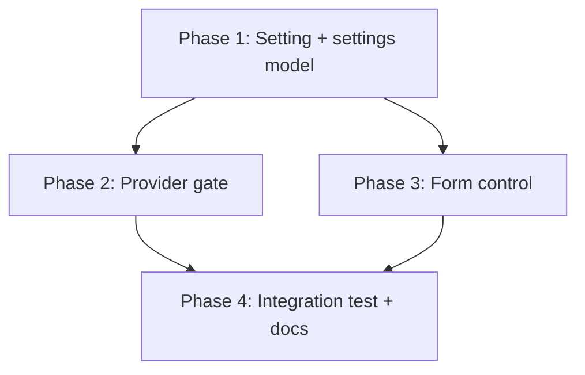
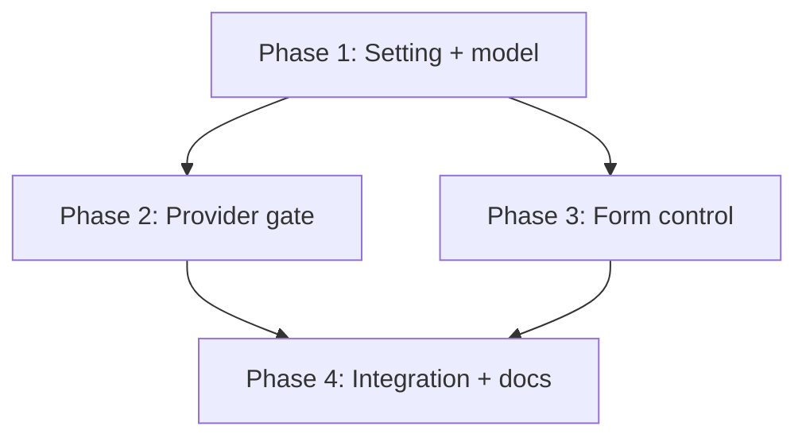

# Implementation Plan: Let a workspace opt out of inherited per-shell configuration

## Overview

Add a new boolean setting `wcli0.ignoreInheritedShells` that gates `hasPerShellConfig`, wire it
through the normalized settings model, surface it in the configuration form, and document it. The work
is layered: settings model first (the authoritative gate), then provider behavior, then the form, then
docs, with an integration test validating the real VS Code deep-merge case.

## Affected Files

| File | Change Type | Description |
| ---- | ----------- | ----------- |
| vscode-extension/package.json | Update | Add `wcli0.ignoreInheritedShells` boolean setting |
| vscode-extension/src/settings.ts | Update | Add flag to `Wcli0Settings`/`buildSettings`; gate `hasPerShellConfig` |
| vscode-extension/src/mcpProvider.ts | Modify | No logic change if gating lives in `hasPerShellConfig`; verify launch path |
| vscode-extension/src/webview.ts | Update | Add flag to `FIELD_KEYS`, render the toggle, wire `collect`/`setVal` |
| vscode-extension/test/unit/settings.test.cjs | Update | `hasPerShellConfig` gate tests |
| vscode-extension/test/unit/webview.test.cjs | Update | Host save/round-trip of the flag |
| vscode-extension/test/unit/webviewShells.test.cjs | Update | Form collect/populate of the toggle |
| vscode-extension/test/integration/extension.test.js | Update | Real deep-merge end-to-end test |
| vscode-extension/README.md | Update | Document inherit-vs-mask |

## Phase 1: Setting and settings model

### Implementation Work (settings model)

- Add `wcli0.ignoreInheritedShells` (boolean, default false, `scope: "resource"`) to
  `package.json` with a `markdownDescription` explaining inherit-vs-mask.
- Add `ignoreInheritedShells: boolean` to `Wcli0Settings` and read it in `buildSettings`
  (`g<boolean>('ignoreInheritedShells', false)`).
- Gate `hasPerShellConfig(s)`: return `false` when `s.ignoreInheritedShells` is true.

### Test Work (settings model)

- `settings.test.cjs`: assert `hasPerShellConfig` is false when the flag is set with a non-empty
  `shells`, and true when the flag is false with the same `shells`.

### Verification (settings model)

- `npx tsc --noEmit` clean.
- `node --require ./test/stubs/hook.cjs --test test/unit/settings.test.cjs` passes.

## Phase 2: Provider gate

### Implementation Work (provider gate)

- Confirm `provideMcpServerDefinitions` and the export commands (`showLaunchCommand`,
  `writeWorkspaceMcpJson`) all branch on `hasPerShellConfig`, so gating there is sufficient; adjust any
  site that inspects `s.shells` directly instead of `hasPerShellConfig`.

### Test Work (provider gate)

- `mcpProvider.test.cjs`: with the flag set, the provider registers a CLI-flag launch (no managed
  `--config`) even when `shells` is non-empty.

### Verification (provider gate)

- Provider unit tests pass; the registered args match the CLI-flag path.

## Phase 3: Form control

### Implementation Work (form control)

- Add `ignoreInheritedShells` to `FIELD_KEYS` in `webview.ts`.
- Render a labeled checkbox near the per-shell cards header with hint text; show it as
  Workspace-relevant.
- Wire it in `collect()` (emit boolean or null/clear per the existing scoped-boolean pattern) and
  `setVal()` (reflect the stored value).

### Test Work (form control)

- `webviewShells.test.cjs`: the toggle populates from init and is collected on save.
- `webview.test.cjs`: saving the flag persists the boolean and does NOT clear `wcli0.shells`.

### Verification (form control)

- Unit suite passes.

## Phase 4: Integration test and documentation

### Implementation Work (integration and docs)

- Update `README.md` with an inherit-vs-mask section.

### Test Work (integration and docs)

- `extension.test.js`: set User `wcli0.shells` (non-empty) and Workspace
  `wcli0.ignoreInheritedShells = true` in the real host; assert the effective config is NOT in
  per-shell mode (CLI-flag launch), then unset the flag and assert it returns to managed mode.

### Verification (integration and docs)

- `npx tsc --noEmit`, full unit suite, `npx vscode-test`, and `markdownlint-cli2` all pass.

## Dependency Graph

## Estimated Scope

| Phase | Source Files | Test Files | Effort |
| ----- | ------------ | ---------- | ------ |
| Phase 1 | 2 | 1 | Small |
| Phase 2 | 1 | 1 | Small |
| Phase 3 | 1 | 2 | Medium |
| Phase 4 | 1 | 1 | Medium |
