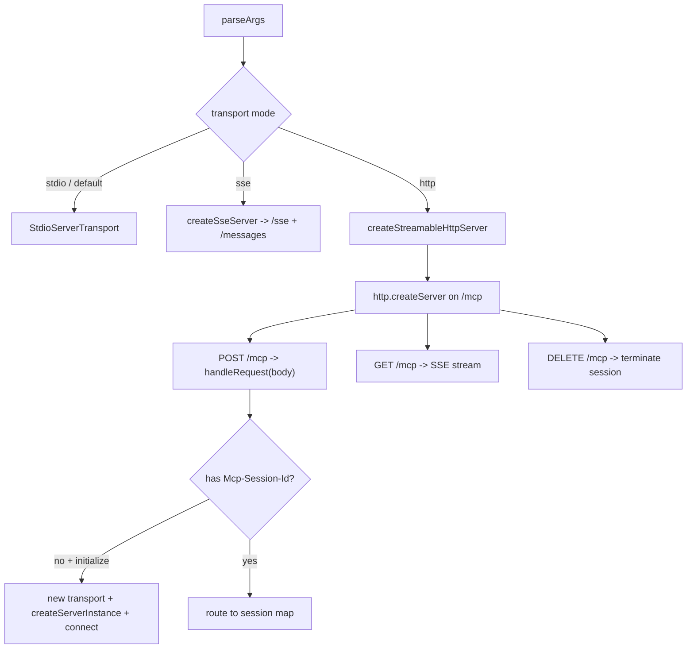
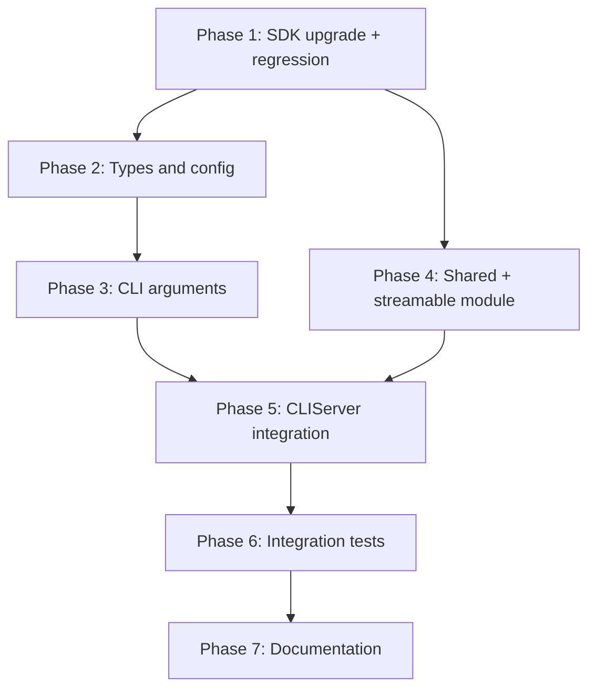

# Implementation Plan: Streamable HTTP Transport for MCP Server

## Overview

Upgrade the MCP SDK to a version that ships `StreamableHTTPServerTransport`, then
add a new `http` transport mode that serves a single `/mcp` endpoint with
stateful sessions. The work reuses the per-connection `createServerInstance()`
pattern (for working-directory isolation) and the origin/CORS/socket plumbing
already proven by the SSE transport, which is first extracted into a shared
module so both transports share one implementation.



## Affected Files

| File | Change Type | Description |
| ---- | ----------- | ----------- |
| `package.json` | Update | Bump `@modelcontextprotocol/sdk` to latest stable (e.g. `1.29.0`) |
| `package-lock.json` | Update | Lockfile regenerated by `npm install` |
| `src/types/config.ts` | Update | `mode` union adds `'http'`; add `httpHost`, `httpPort`, `httpAllowedOrigins` |
| `src/utils/config.ts` | Update | Defaults, merge, `applyCliTransport()`, `validateTransportConfig()`, serialization |
| `src/utils/httpShared.ts` | Create | Extracted `isOriginAllowed`, `corsOriginToEcho`, socket tracking, `closeHttpServer` |
| `src/utils/transport.ts` | Update | Import shared helpers from `httpShared` (behavior unchanged) |
| `src/utils/streamableHttp.ts` | Create | `createStreamableHttpServer()`, `/mcp` routing, session map |
| `src/index.ts` | Update | New CLI flags, `run()` http branch, `cleanup()` stdin condition |
| `tests/unit/streamableHttp.test.ts` | Create | Config/CLI/validation/origin unit tests |
| `tests/helpers/StreamableHttpTestClient.ts` | Create | Integration client helper |
| `tests/integration/streamable-http-transport.test.ts` | Create | Handshake + lifecycle |
| `tests/integration/streamable-http-tool-execution.test.ts` | Create | Tool calls |
| `tests/integration/streamable-http-resources.test.ts` | Create | Resource reads |
| `tests/integration/streamable-http-security.test.ts` | Create | Origin/CORS/Host |
| `tests/integration/streamable-http-sessions.test.ts` | Create | Sessions, DELETE, edge cases |
| `README.md` | Update | Document `http` mode, flags, config, security |

## Phase 1: SDK Upgrade and Regression

### Implementation Work (Phase 1)

- Bump `@modelcontextprotocol/sdk` in `package.json` from `1.0.1` to the latest
  stable that exports `StreamableHTTPServerTransport` (confirm with
  `npm view @modelcontextprotocol/sdk version`; currently `1.29.0`).
- Run `npm install` to regenerate `package-lock.json`.
- Build with `npm run build`; fix any breaking API or type changes surfaced by
  `tsc` in `src/index.ts` (low-level `Server` / `setRequestHandler` usage) and
  elsewhere. Confirm `server/streamableHttp.js` now exists in the installed SDK.

### Test Work (Phase 1)

- No new tests yet. Adjust existing tests only if the SDK upgrade changes
  observable handshake behavior (for example default protocol version); pin
  `protocolVersion` in `SseTestClient` if required.

### Verification (Phase 1)

```bash
npm run lint
npm test
node -e "require('@modelcontextprotocol/sdk/server/streamableHttp.js'); console.log('streamableHttp present')"
```

Expected: lint clean, full suite green with no worker warnings, the require
succeeds.

## Phase 2: Types and Configuration

### Implementation Work (Phase 2)

- In `src/types/config.ts`: change `TransportConfig.mode` to
  `'stdio' | 'sse' | 'http'`; add optional `httpHost?: string`,
  `httpPort?: number`, `httpAllowedOrigins?: string[]` with doc comments.
- In `src/utils/config.ts`:
  - Extend `DEFAULT_CONFIG.transport` with `httpHost: '127.0.0.1'`,
    `httpPort: 9444`, `httpAllowedOrigins: []`.
  - Extend the transport merge block so file-provided http fields survive.
  - Extend `applyCliTransport()` to accept `http` for `--transport` and apply
    `httpHost`/`httpPort`/`httpAllowedOrigins` (reuse the integer-port guard and
    comma-split origin parsing).
  - Extend `validateTransportConfig()` to allow `mode: 'http'` and validate
    `httpHost` (non-empty string), `httpPort` (integer `1..65535`), and
    `httpAllowedOrigins` (array of strings).
  - Ensure `createSerializableConfig()` continues to copy the full `transport`
    object (now including http fields).

### Test Work (Phase 2)

- Unit tests in `tests/unit/streamableHttp.test.ts`: http defaults, config-file
  http values respected, `applyCliTransport()` overrides, fractional `httpPort`
  ignored, `validateTransportConfig()` accepts `http` and rejects bad fields.

### Verification (Phase 2)

```bash
npm run lint
npm test -- tests/unit/streamableHttp.test.ts
```

Expected: unit tests pass; defaults and overrides behave as specified.

## Phase 3: CLI Arguments

### Implementation Work (Phase 3)

- In `parseArgs()` (`src/index.ts`): add `'http'` to the `--transport` choices;
  add `--http-host` (string), `--http-port` (number), `--http-allowed-origins`
  (string) options with descriptions and defaults noted.
- In `main()`: pass the new args into `applyCliTransport()`.

### Test Work (Phase 3)

- Unit tests: `parseArgs` accepts `--transport http`, parses `--http-host`,
  `--http-port`, `--http-allowed-origins`; rejects an invalid `--transport` value.

### Verification (Phase 3)

```bash
npm run lint
npm test -- tests/unit/
```

Expected: CLI parsing tests pass.

## Phase 4: Shared HTTP Module and Streamable HTTP Transport

### Implementation Work (Phase 4)

- Create `src/utils/httpShared.ts`: move `isOriginAllowed`, `parseAllowedOriginHost`,
  `corsOriginToEcho`, `LOOPBACK_HOSTS`, the `serverSockets` WeakMap + connection
  tracking, and a generic `closeHttpServer(server)` (the current `closeSseServer`
  body). Export them.
- Update `src/utils/transport.ts` to import from `httpShared.ts`; keep
  `closeSseServer` as a re-export of `closeHttpServer` (or update the single
  caller). Behavior must be unchanged.
- Create `src/utils/streamableHttp.ts` with
  `createStreamableHttpServer(createServer: () => Server, host: string, port:
  number, allowedOrigins?: readonly string[]): Promise<http.Server>`:
  - `http.createServer` with defensive URL parse (400 on malformed Host), origin
    check (403), CORS echo, and `OPTIONS` 204 (reuse `httpShared`).
  - Maintain `sessions = new Map<string, { transport: StreamableHTTPServerTransport;
    server: Server }>`.
  - For `POST/GET/DELETE` on `/mcp`: read the `Mcp-Session-Id` header. If present
    and known, route to the stored transport's `handleRequest(req, res, body?)`.
  - For a `POST /mcp` with no session id, parse the body; if it is an `initialize`
    request, create a new transport (`sessionIdGenerator: () => randomUUID()`,
    `onsessioninitialized` stores the entry), build a server via the factory,
    register `res`/`transport.onclose` cleanup *before* `connect()`, `connect()`,
    then `handleRequest(req, res, body)`. Non-initialize without a session id
    returns the SDK-appropriate error.
  - `DELETE` removal and `onclose` both delete the session entry.
  - Track sockets and resolve with the listening server (reuse `httpShared`).
- Use `randomUUID` from `node:crypto`.

### Test Work (Phase 4)

- Unit tests: `isOriginAllowed` via `httpShared` (parity with prior SSE tests);
  a focused test that `createStreamableHttpServer` listens and that a `POST /mcp`
  with a hostile `Origin` returns 403 (using a stub server factory).

### Verification (Phase 4)

```bash
npm run lint
npm test -- tests/unit/streamableHttp.test.ts tests/unit/transport.test.ts
```

Expected: new module unit tests pass; existing transport unit tests still pass
(refactor introduced no behavior change).

## Phase 5: CLIServer Integration

### Implementation Work (Phase 5)

- In `CLIServer.run()` (`src/index.ts`): add a `this.config.transport?.mode ===
  'http'` branch that resolves host/port/allowedOrigins from the http config
  fields and calls `createStreamableHttpServer(() => this.createServerInstance({
  activeCwd: this.primarySession.activeCwd }), host, port, allowedOrigins)`,
  storing `this.httpServer`. Emit the debug bind log.
- In `cleanup()`: change the stdin-pause guard so stdin is paused only in stdio
  mode (treat `http` like `sse`). The existing `this.httpServer` close path already
  covers the http server (uses the shared close helper).

### Test Work (Phase 5)

- Covered by Phase 6 integration tests (server start/stop in http mode).

### Verification (Phase 5)

```bash
npm run lint
npm run build
```

Expected: builds clean; manual `node dist/index.js --transport http --debug`
logs the bind address and a liveness probe on `/mcp` responds.

## Phase 6: Integration Tests

### Implementation Work (Phase 6)

- Create `tests/helpers/StreamableHttpTestClient.ts`: starts a `CLIServer` with
  `transport.mode = 'http'`, `httpPort: 0`, mirrors `SseTestClient`'s WSL-emulator
  setup, performs the `initialize` `POST /mcp` (with `Accept: application/json,
  text/event-stream`), captures `Mcp-Session-Id`, exposes `call()`/`callTool()`
  that POST with the session header and parse JSON-or-SSE responses, and a
  `close()` that calls `cleanup()`.

### Test Work (Phase 6)

- `streamable-http-transport.test.ts`: initialize handshake, `tools/list`, clean
  shutdown, port released.
- `streamable-http-tool-execution.test.ts`: `execute_command` output, per-call
  `timeout`/`maxOutputLines` options.
- `streamable-http-resources.test.ts`: `resources/list`, `resources/read`
  (`cli://config`, logs resources).
- `streamable-http-security.test.ts`: untrusted origin 403, no-origin allowed,
  configured allowed origin + CORS headers, `OPTIONS` 204, malformed `Host` 400.
- `streamable-http-sessions.test.ts`: two isolated sessions (working-directory
  isolation), unknown session 404, `DELETE /mcp` termination, malformed JSON body
  400, open-and-abort stream does not leak a session entry.

### Verification (Phase 6)

```bash
npm run lint
npm test -- tests/integration/streamable-http-transport.test.ts
npm test
```

Expected: all streamable-http suites pass; full regression green (stdio + SSE
unaffected); no worker-exit warning.

## Phase 7: Documentation

### Implementation Work (Phase 7)

- Update `README.md`: add `http` to the transport section, document
  `--http-host` / `--http-port` / `--http-allowed-origins` (table with defaults),
  the `transport` config fields, `/mcp` endpoint semantics (POST/GET/DELETE and
  `Mcp-Session-Id`), the relationship to the deprecated legacy `sse` mode, and the
  security guidance (loopback default, origin validation, no built-in auth).

### Test Work (Phase 7)

- Verify README examples are syntactically correct; run the markdown linter.

### Verification (Phase 7)

```bash
npm run lint
npx markdownlint-cli2 "README.md" "docs/tasks/streamable_http_transport/*.md"
```

Expected: lint clean, no markdown errors.

## Dependency Graph



## Estimated Scope

| Phase | Source Files | Test Files | Effort |
| ----- | ------------ | ---------- | ------ |
| Phase 1 | 2 | 0 | Medium |
| Phase 2 | 2 | 1 | Small |
| Phase 3 | 1 | 1 | Small |
| Phase 4 | 3 | 1 | Large |
| Phase 5 | 1 | 0 | Small |
| Phase 6 | 0 | 6 | Large |
| Phase 7 | 1 | 0 | Small |
